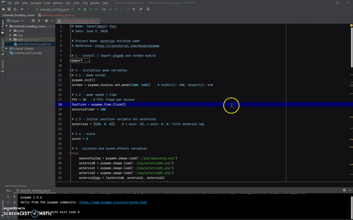

# Asteroids Avoiding Game using Python

  

This repository contains an asteroids avoiding game using Python (pygame module). Hopfully you enjoy the game!

## Installation
1. Download the clone of the project from this github repo
2. Unzip the file
3. Open the folder in PyCharm Community Edition
4. Run the code (You can simply press Ctrl+Shift+F10)
5. Enjoy the game!

## NOTE
The game level will be difficult, which means the speed will go up.

## Reference
### What is pygame module?
https://riptutorial.com/ebook/pygame

### Download PyCharm Community Edition
https://www.jetbrains.com/pycharm/download/#section=windows
